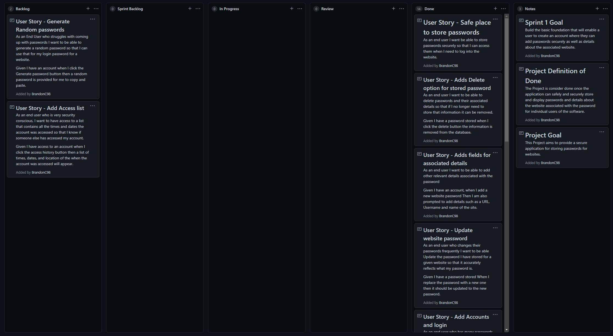
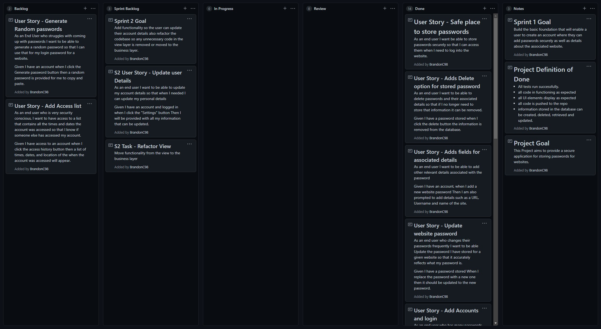

# Project Definition of Done

- All tests run successfully.
- All code in functioning as expected
- All UI elements display as expected 
- All code is pushed to the repo
- information is securely stored
- Information stored in the database can be created, deleted, retrieved and updated.

# Project Goal

This Project aims to provide a secure application for storing passwords for websites.

# Sprints

- ## Sprint 1

  ### Goal

    Build the basic foundation that will enable a user to create an account where they can add passwords securely as well as details about the associated website.

    ### Completed items:

     - User Story - Safe place to store passwords
     - User Story - Adds Delete option for stored password
     - User Story - Adds fields for associated details  
     - User Story - Update website password  
     - User Story - Add Accounts and login
     - Task - Make the Database classes
     
    ### Sprint Retrospective

    I learned methods to securely store data, gained a better understanding of how test driven development is applied to a project as well adding more depth to my knowledge of how to apply entity framework. 

    In future for a project of this type I would use a Database first approach as it makes a bit more sense for the data I'm working with. I would also set aside more type for the frontend development of the application 

- ### Sprint 2 Goal

    Add functionality so the user can update their account details also refactor the codebase so any unnecessary code in the view layer is removed or moved to the business layer.

# Project border states:
- End of Sprint 1 view

- Start of Sprint 2 view

# User Guide

### logging in
1.1 - if the user doesn't have an account, they need to click the "Sign up" button on the top left. If they do then skip to step 1.3

1.2 - the user needs to provide a first name, last name, email address and master password in the appropriate text boxes. once done click the create button. if successful a message box will appear telling the user their account was created and it will then take them to the login screen.

1.3 - the user needs to type in their email and master password for their account. If done correctly they will be taken to window which lists all websites the user has created an entry for.

### Creating a new entry

2.1 - Once logged in the user should see a "New Entry" button on the top left. Once clicked places for the user to fill in the details that they want to store will be shown. once the user has filled in the details, they need to click the "create" button.

2.2 - Then the user will be shown a new window asking the user to provide their master password. This is so their website password can be encrypted, the application will use the master password as a key to access and decrypted their password in the future.

2.3 - Once done the user should see their new entry within the list of entries on the left.

### Accessing and updating stored information

3.1 - once logged in if the user clicks the name of the entry they want to access on the left of the screen. This will prompt the user for their master password.

3.2 - Once the master password has been entered the right side of the screen will show the details about the entry they wanted to access. from here the user can copy any of the details they need to use.

3.3 - If the user intends to update the details all they need to do is replace the text with the new information and click the "Update" button. once they have entered their master password the information for that entry will be updated.
